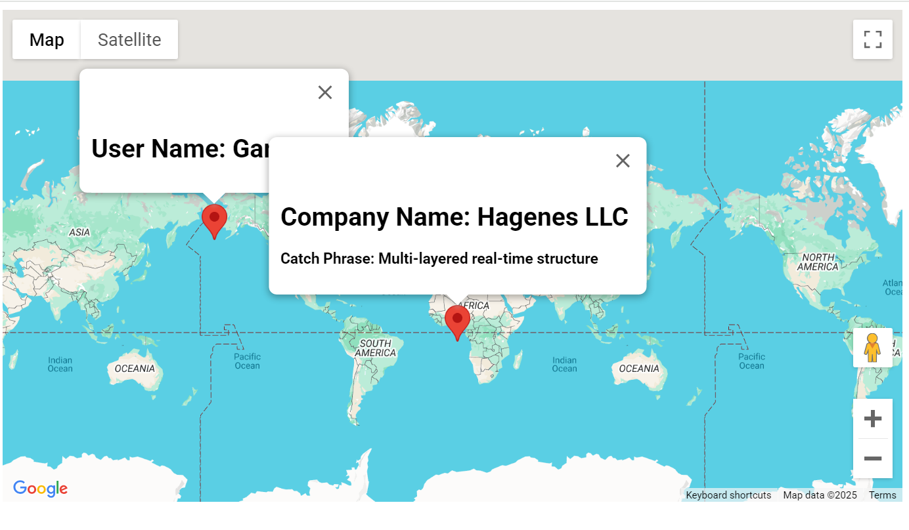

# A simple implementation of google-maps with TS and parcel-bundler for web UI testing

Before run, install parcel-bundler
 
"npm install -g parcel-bundler"
 

To Run,
 

"npx parcel index.html"
  

